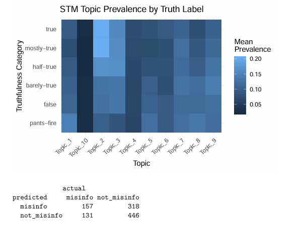
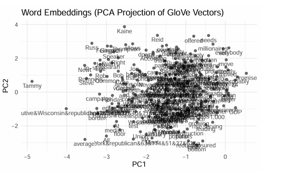
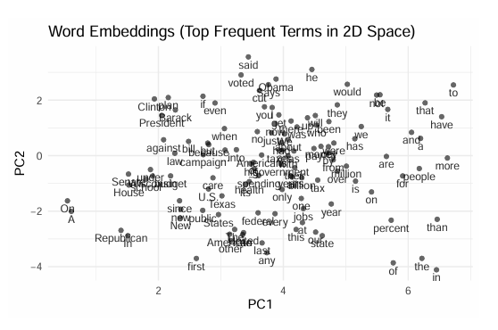

# Political Misinformation Text Analysis

## Project Overview

This project analyzes linguistic and topical patterns in political misinformation using the LIAR dataset, a widely used benchmark dataset for fake news and misinformation research. The analysis focused on identifying language patterns, topical trends, and communication characteristics associated with political misinformation statements.

The project combined text analytics, exploratory data analysis, and natural language processing (NLP) techniques to examine how misinformation content varies across topics, language structures, and truthfulness classifications.

The workflow included:
- Text preprocessing and cleaning
- Exploratory text analysis
- Linguistic pattern analysis
- Topic analysis
- Data visualization
- Analytical reporting and presentation development

---

## Business Problem

Political misinformation presents significant challenges for public trust, media reliability, and informed decision-making. The rapid spread of misleading information through digital platforms has increased the need for analytical methods capable of identifying patterns associated with misinformation content.

This project explored how text analytics and NLP techniques can be used to better understand misinformation characteristics and support future misinformation detection and classification efforts.

The analysis demonstrates how data analytics methods can be applied to real-world communication and information integrity challenges.

---

## Dataset Information

The project utilized the LIAR dataset, a publicly available benchmark dataset commonly used for misinformation and fake news research.

The dataset contains political statements labeled across multiple truthfulness categories, including:
- True
- Mostly True
- Half True
- Barely True
- False
- Pants on Fire

The analysis focused on identifying linguistic trends, topical distributions, and textual characteristics associated with misinformation patterns.

---

## Tools & Technologies

- R / Quarto
- Text Analytics
- Natural Language Processing (NLP)
- Data Visualization
- Exploratory Data Analysis (EDA)
- Topic Analysis
- Linguistic Analysis
- Statistical Analysis
- Microsoft PowerPoint
- Data Storytelling & Presentation Design

---

### STM Topic Prevalence by Truth Label

Analyzes how political topics vary across truthfulness categories using Structural Topic Modeling (STM). The visualization demonstrates that certain political topics appear more frequently in misinformation-related categories such as "false" and "pants-fire," while others are more associated with truthful statements.

This analysis highlights how misinformation is often tied to specific issue domains rather than being evenly distributed across political discourse.



---

### Word Embeddings — GloVe Vector Projection

Visualizes semantic relationships between political terms using GloVe-style word embeddings projected into two-dimensional space with PCA. Words positioned closer together share stronger contextual relationships within the dataset.

The visualization demonstrates how political language naturally forms semantic clusters around topics such as elections, healthcare, taxation, and government policy.



---

### Word Embeddings — Frequent Terms in 2D Space

Displays the spatial relationships between frequently occurring political terms after dimensionality reduction. This analysis helps illustrate how recurring political language patterns cluster together semantically across the corpus.

The embedding analysis supports the broader findings of the project by revealing meaningful contextual groupings in political communication.



---

## Repository Structure

```text
report/         -> Final analytical report
presentation/   -> Presentation slides, video, and notes
source/         -> Quarto source files and analysis workflow
```

---

## Key Areas of Analysis

- Linguistic patterns in political misinformation
- Topic distribution analysis
- Truthfulness category comparisons
- Exploratory text analytics
- Communication pattern evaluation
- Political misinformation trends
- Data visualization and reporting

---

## Project Outcome

The project demonstrated how text analytics and NLP techniques can be used to explore patterns in political misinformation and identify relationships between language usage, topical content, and truthfulness classifications.

The analysis reinforced the value of data analytics and natural language processing methods in understanding misinformation behavior and supporting future research in misinformation detection and information integrity analysis.
